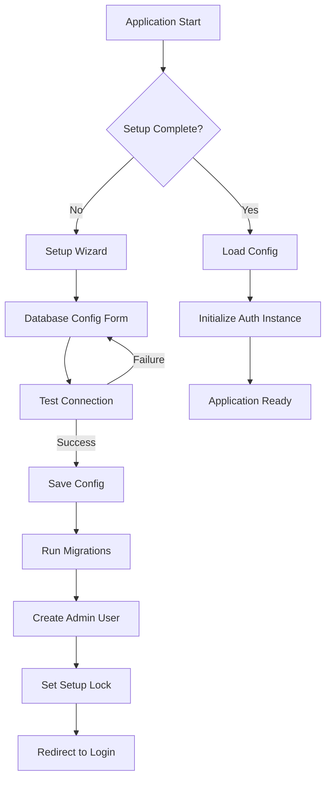

# Design Document

## Overview

This design implements a database configuration setup system that allows users to configure their preferred database (SQLite or PostgreSQL) during initial application installation. The system consists of a multi-step setup wizard, secure configuration storage, dynamic Auth Instance initialization, and automatic schema migration.

The design leverages Better Auth's flexible adapter system to support multiple database types while maintaining a consistent authentication interface. Configuration is stored securely with encrypted credentials, and the application dynamically initializes the appropriate database adapter on startup.

## Architecture

### High-Level Architecture



### Component Architecture

The system is organized into the following layers:

1. **Presentation Layer**: Setup wizard UI components and forms
2. **Configuration Layer**: Configuration management, validation, and storage
3. **Database Layer**: Dynamic adapter initialization and connection management
4. **Migration Layer**: Schema generation and database setup
5. **Security Layer**: Credential encryption and setup lock management

## Components and Interfaces

### 1. Configuration Store (`app/lib/config.server.ts`)

Manages persistent storage of database configuration with encryption for sensitive data.

```typescript
interface DatabaseConfig {
  type: 'sqlite' | 'postgresql';
  sqlite?: {
    filePath: string;
  };
  postgresql?: {
    host: string;
    port: number;
    database: string;
    username: string;
    password: string;
    schema?: string;
    ssl?: boolean;
  };
}

interface SetupConfig {
  setupComplete: boolean;
  databaseConfig: DatabaseConfig;
  createdAt: string;
  updatedAt: string;
}

class ConfigStore {
  private configPath: string;
  private encryptionKey: string;

  constructor();
  
  // Load configuration from disk
  async load(): Promise<SetupConfig | null>;
  
  // Save configuration to disk with encryption
  async save(config: SetupConfig): Promise<void>;
  
  // Check if setup is complete
  async isSetupComplete(): Promise<boolean>;
  
  // Encrypt sensitive data
  private encrypt(data: string): string;
  
  // Decrypt sensitive data
  private decrypt(data: string): string;
  
  // Reset configuration (admin only)
  async reset(): Promise<void>;
}
```

**Storage Location**: `.data/config.json` (encrypted)

**Encryption**: Uses Node.js `crypto` module with AES-256-GCM encryption. Encryption key is derived from `BETTER_AUTH_SECRET` environment variable.

### 2. Database Connection Manager (`app/lib/db-connection.server.ts`)

Handles database connection testing and adapter initialization.

```typescript
interface ConnectionTestResult {
  success: boolean;
  error?: string;
  errorType?: 'network' | 'authentication' | 'permissions' | 'unknown';
  suggestions?: string[];
}

class DatabaseConnectionManager {
  // Test database connection
  async testConnection(config: DatabaseConfig): Promise<ConnectionTestResult>;
  
  // Create database adapter based on config
  async createAdapter(config: DatabaseConfig): Promise<Adapter>;
  
  // Test SQLite connection
  private async testSQLiteConnection(config: DatabaseConfig['sqlite']): Promise<ConnectionTestResult>;
  
  // Test PostgreSQL connection
  private async testPostgreSQLConnection(config: DatabaseConfig['postgresql']): Promise<ConnectionTestResult>;
  
  // Get error suggestions based on error type
  private getErrorSuggestions(errorType: string, dbType: string): string[];
}
```

**Dependencies**:
- `better-sqlite3` for SQLite
- `pg` (PostgreSQL client) for PostgreSQL

### 3. Migration Manager (`app/lib/migration.server.ts`)

Handles database schema creation and migration using Better Auth CLI programmatically.

```typescript
interface MigrationResult {
  success: boolean;
  tablesCreated?: string[];
  error?: string;
  failedTable?: string;
}

class MigrationManager {
  // Run migrations for the configured database
  async runMigrations(adapter: Adapter): Promise<MigrationResult>;
  
  // Generate schema using Better Auth CLI
  private async generateSchema(): Promise<void>;
  
  // Apply migrations to database
  private async applyMigrations(adapter: Adapter): Promise<MigrationResult>;
  
  // Verify schema creation
  async verifySchema(adapter: Adapter): Promise<boolean>;
}
```

**Migration Strategy**:
- Uses Better Auth's built-in schema generation
- Programmatically invokes `@better-auth/cli` commands
- Creates tables for: users, sessions, accounts, verifications, two-factor, activity logs

### 4. Dynamic Auth Instance (`app/lib/auth.server.ts` - Refactored)

Refactored to dynamically initialize based on stored configuration.

```typescript
// Dynamic auth instance initialization
let authInstance: ReturnType<typeof betterAuth> | null = null;

async function initializeAuth(): Promise<ReturnType<typeof betterAuth>> {
  if (authInstance) return authInstance;
  
  const configStore = new ConfigStore();
  const config = await configStore.load();
  
  if (!config || !config.setupComplete) {
    throw new Error('Database not configured. Please complete setup.');
  }
  
  const connectionManager = new DatabaseConnectionManager();
  const adapter = await connectionManager.createAdapter(config.databaseConfig);
  
  authInstance = betterAuth({
    database: adapter,
    baseURL: process.env.BETTER_AUTH_URL || "http://localhost:5173",
    secret: process.env.BETTER_AUTH_SECRET || "your-secret-key-change-in-production",
    // ... rest of configuration
  });
  
  return authInstance;
}

// Export lazy-loaded auth instance
export const auth = new Proxy({} as ReturnType<typeof betterAuth>, {
  get: (target, prop) => {
    return async (...args: any[]) => {
      const instance = await initializeAuth();
      return (instance as any)[prop](...args);
    };
  }
});
```

### 5. Setup Wizard Routes

#### Route: `/setup` (`app/routes/setup.tsx`)

Main setup wizard route with multi-step form.

```typescript
export async function loader({ request }: LoaderFunctionArgs) {
  const configStore = new ConfigStore();
  const isComplete = await configStore.isSetupComplete();
  
  if (isComplete) {
    return redirect('/login');
  }
  
  return json({ step: 1 });
}

export async function action({ request }: ActionFunctionArgs) {
  const formData = await request.formData();
  const action = formData.get('action');
  
  switch (action) {
    case 'test-connection':
      return await handleTestConnection(formData);
    case 'save-config':
      return await handleSaveConfig(formData);
    case 'create-admin':
      return await handleCreateAdmin(formData);
    default:
      return json({ error: 'Invalid action' }, { status: 400 });
  }
}
```

#### Route: `/api/setup/test-connection` (`app/routes/api.setup.test-connection.ts`)

API endpoint for testing database connections.

```typescript
export async function action({ request }: ActionFunctionArgs) {
  const body = await request.json();
  const config = parseAndValidateConfig(body);
  
  const connectionManager = new DatabaseConnectionManager();
  const result = await connectionManager.testConnection(config);
  
  return json(result);
}
```

### 6. Setup Wizard UI Components

#### Component: `SetupWizard` (`app/components/setup/SetupWizard.tsx`)

Main wizard component managing multi-step flow.

```typescript
interface SetupWizardProps {
  initialStep?: number;
}

export function SetupWizard({ initialStep = 1 }: SetupWizardProps) {
  const [step, setStep] = useState(initialStep);
  const [config, setConfig] = useState<Partial<DatabaseConfig>>({});
  
  return (
    <div className="setup-wizard">
      <StepIndicator currentStep={step} totalSteps={4} />
      
      {step === 1 && <DatabaseTypeSelector onNext={handleTypeSelect} />}
      {step === 2 && <DatabaseConfigForm config={config} onNext={handleConfigSubmit} />}
      {step === 3 && <MigrationProgress onComplete={handleMigrationComplete} />}
      {step === 4 && <AdminUserForm onComplete={handleSetupComplete} />}
    </div>
  );
}
```

#### Component: `DatabaseConfigForm` (`app/components/setup/DatabaseConfigForm.tsx`)

Dynamic form that adapts based on selected database type.

```typescript
interface DatabaseConfigFormProps {
  config: Partial<DatabaseConfig>;
  onNext: (config: DatabaseConfig) => void;
  onBack: () => void;
}

export function DatabaseConfigForm({ config, onNext, onBack }: DatabaseConfigFormProps) {
  const [testing, setTesting] = useState(false);
  const [testResult, setTestResult] = useState<ConnectionTestResult | null>(null);
  
  const handleTestConnection = async () => {
    setTesting(true);
    const result = await fetch('/api/setup/test-connection', {
      method: 'POST',
      body: JSON.stringify(config),
    }).then(r => r.json());
    setTestResult(result);
    setTesting(false);
  };
  
  return (
    <form>
      {config.type === 'postgresql' && <PostgreSQLFields />}
      {config.type === 'sqlite' && <SQLiteFields />}
      
      <Button onClick={handleTestConnection} disabled={testing}>
        {testing ? 'Testing...' : 'Test Connection'}
      </Button>
      
      {testResult && <ConnectionTestResult result={testResult} />}
      
      <Button onClick={onNext} disabled={!testResult?.success}>
        Continue
      </Button>
    </form>
  );
}
```

#### Component: `MigrationProgress` (`app/components/setup/MigrationProgress.tsx`)

Shows real-time migration progress.

```typescript
interface MigrationProgressProps {
  onComplete: () => void;
}

export function MigrationProgress({ onComplete }: MigrationProgressProps) {
  const [status, setStatus] = useState<'running' | 'success' | 'error'>('running');
  const [progress, setProgress] = useState<string[]>([]);
  
  useEffect(() => {
    runMigration();
  }, []);
  
  const runMigration = async () => {
    // Poll migration status endpoint
    const eventSource = new EventSource('/api/setup/migrate');
    
    eventSource.onmessage = (event) => {
      const data = JSON.parse(event.data);
      setProgress(prev => [...prev, data.message]);
      
      if (data.complete) {
        setStatus(data.success ? 'success' : 'error');
        eventSource.close();
        if (data.success) onComplete();
      }
    };
  };
  
  return (
    <div>
      <h2>Setting up database...</h2>
      <ProgressLog messages={progress} />
      {status === 'error' && <ErrorMessage />}
    </div>
  );
}
```

## Data Models

### Configuration File Structure

```json
{
  "setupComplete": true,
  "databaseConfig": {
    "type": "postgresql",
    "postgresql": {
      "host": "localhost",
      "port": 5432,
      "database": "userdb",
      "username": "admin",
      "password": "encrypted:AES256:...",
      "schema": "public",
      "ssl": false
    }
  },
  "createdAt": "2025-01-01T00:00:00Z",
  "updatedAt": "2025-01-01T00:00:00Z"
}
```

### Environment Variables

```bash
# Required
BETTER_AUTH_SECRET=your-secret-key-for-encryption-and-auth
BETTER_AUTH_URL=http://localhost:5173

# Optional (for development/testing)
SKIP_SETUP=false
```

## Error Handling

### Connection Error Types and Handling

1. **Network Errors** (ECONNREFUSED, ETIMEDOUT)
   - Suggestion: Check if database server is running
   - Suggestion: Verify host and port are correct
   - Suggestion: Check firewall settings

2. **Authentication Errors** (Invalid credentials)
   - Suggestion: Verify username and password
   - Suggestion: Check user has login permissions
   - Suggestion: Ensure user exists in database

3. **Permission Errors** (Access denied to database)
   - Suggestion: Grant CREATE TABLE permissions
   - Suggestion: Verify database exists
   - Suggestion: Check user has sufficient privileges

4. **SSL/TLS Errors**
   - Suggestion: Try enabling/disabling SSL
   - Suggestion: Verify SSL certificate configuration

### Migration Error Handling

- Log detailed error information including SQL statements
- Identify which table failed to create
- Provide rollback mechanism for partial migrations
- Allow retry after fixing issues

### Setup Lock Protection

- Prevent access to setup wizard after completion
- Require admin authentication to reset setup
- Log all setup reset attempts for security audit

## Testing Strategy

### Unit Tests

1. **ConfigStore Tests**
   - Test encryption/decryption
   - Test save/load operations
   - Test setup completion checks

2. **DatabaseConnectionManager Tests**
   - Mock database connections
   - Test error handling for each database type
   - Test connection string generation

3. **MigrationManager Tests**
   - Test schema generation
   - Test migration application
   - Test rollback on failure

### Integration Tests

1. **Setup Wizard Flow**
   - Test complete setup flow for each database type
   - Test validation and error messages
   - Test navigation between steps

2. **Database Adapter Initialization**
   - Test SQLite adapter creation
   - Test PostgreSQL adapter creation
   - Test MySQL adapter creation

3. **Auth Instance Initialization**
   - Test lazy loading of auth instance
   - Test error handling when setup incomplete
   - Test configuration reload

### End-to-End Tests

1. **Complete Setup Process**
   - Fresh installation → Setup wizard → Admin creation → Login
   - Test with SQLite
   - Test with PostgreSQL (requires test database)
   - Test with MySQL (requires test database)

2. **Setup Lock Verification**
   - Verify setup wizard redirects after completion
   - Verify application functions normally after setup

3. **Configuration Persistence**
   - Restart application and verify config loads
   - Verify encrypted credentials work correctly

## Security Considerations

### Credential Encryption

- Use AES-256-GCM for encrypting database passwords
- Derive encryption key from `BETTER_AUTH_SECRET`
- Store encrypted credentials in config file
- Never log or expose decrypted credentials

### Setup Lock Security

- Store setup completion flag in encrypted config
- Require admin authentication to reset setup
- Log all setup-related actions
- Rate limit setup endpoints

### Input Validation

- Validate all database configuration inputs
- Sanitize connection strings
- Prevent SQL injection in connection parameters
- Validate port numbers and hostnames

### File Permissions

- Set restrictive permissions on config file (600)
- Store config in `.data/` directory (gitignored)
- Ensure config directory is not web-accessible

## Performance Considerations

### Lazy Loading

- Auth instance initialized only when needed
- Configuration loaded once and cached
- Database connections pooled appropriately

### Connection Pooling

- PostgreSQL: Use `pg.Pool` with configurable pool size
- SQLite: Single connection (file-based)

### Migration Performance

- Run migrations asynchronously
- Provide progress feedback to user
- Use transactions for atomic schema changes

## Dependencies

### New Dependencies Required

```json
{
  "dependencies": {
    "pg": "^8.11.0"
  }
}
```

### Existing Dependencies Used

- `better-sqlite3`: SQLite support
- `better-auth`: Authentication framework
- `bcrypt`: Password hashing
- `zod`: Schema validation

## Migration Path from Current Implementation

### Phase 1: Add Configuration Infrastructure

1. Create `ConfigStore` class
2. Create `DatabaseConnectionManager` class
3. Add encryption utilities

### Phase 2: Build Setup Wizard

1. Create setup routes
2. Build UI components
3. Implement connection testing

### Phase 3: Refactor Auth Instance

1. Make auth instance dynamic
2. Add lazy loading
3. Update all auth imports

### Phase 4: Add Migration System

1. Create `MigrationManager` class
2. Integrate Better Auth CLI
3. Add progress tracking

### Phase 5: Testing and Documentation

1. Write tests
2. Update documentation
3. Create migration guide for existing users

## Future Enhancements

1. **Database Connection Pooling Configuration**
   - Allow users to configure pool size
   - Add connection timeout settings

2. **Advanced PostgreSQL Features**
   - Support for read replicas
   - Connection pooling with PgBouncer

3. **Backup and Restore**
   - Automated database backups
   - Configuration export/import

4. **Multi-Database Support**
   - Support for database sharding
   - Read/write splitting

5. **Health Checks**
   - Database connection monitoring
   - Automatic reconnection on failure
